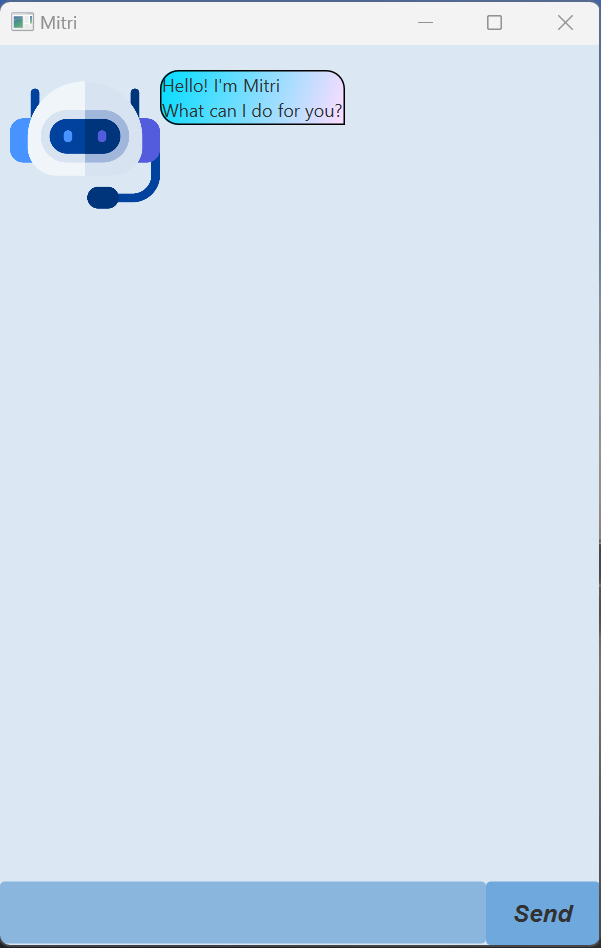

# Mitri User Guide

Mitri is a simple text-based chatbot that helps users to manage their tasks. 
This is built for NUS CS2103T Independent Project.



## Features of Mitri
### Add tasks
#### Todo
Add a new Todo Task to your TaskList.

Example: `todo read book`

Expected outcome: Adds a new todo task.

```
Got it. I've added this task:
    [T][ ] read book
Now you have 1 tasks in the list.
```
#### Deadline
Add a new Deadline Task to your TaskList.

DateTime input for the /by field can be in any of the following forms:
1. YYYY-MM-DDTHH:MM:SS
2. YYYY-MM-DDTHH:MM
3. YYYY-MM-DD
4. HH:MM:SS
5. HH:MM

Example: `deadline return book /by 2025-02-20T07:30:00`

Expected outcome: Adds a new deadline task.

```
Got it. I've added this task:
    [D][ ] return book (by: Feb 20 2025, 07:30:00)
Now you have 2 tasks in the list.
```
#### Event
Add a new Event Task to your TaskList.

DateTime input for the /from and /to fields can be in any of the following forms:
1. YYYY-MM-DDTHH:MM:SS
2. YYYY-MM-DDTHH:MM
3. YYYY-MM-DD
4. HH:MM:SS
5. HH:MM

Ordering of the /from and /to fields does not matter. Descripion of the task should appear before both fields.

Example: `event project meeting /from 08:00 /to 10:45`

Expected outcome: Adds a new event task.

```
Got it. I've added this task:
    [E][ ] project meeting (from: Feb 21 2025, 08:00:00 to: Feb 21 2025, 10:45:00)
Now you have 3 tasks in the list.
```
### List all tasks
List all tasks in your TaskList.

Example: `list`

Expected outcome: Lists all tasks.

```
Here are the tasks in your list:
    1. [T][ ] read book
    2. [D][ ] return book (by: Feb 20 2025, 07:30:00)
    3. [E][ ] project meeting (from: Feb 21 2025, 08:00:00 to: Feb 21 2025, 10:45:00)
```
### Delete a task
Deletes a task from list by specifying its index.

Example: `delete 3`

Expected outcome: Deletes the third task in the list.

```
Got it. I've removed this task:
    [E][ ] project meeting (from: Feb 21 2025, 08:00:00 to: Feb 21 2025, 10:45:00)
Now you have 2 tasks in the list.
```
### Undo last action
Reverts the last **change-producing** command executed.

Example: ```undo```

Expected outcome: Third task is added back to the list.

```
Last change has been reverted!
```
### Mark task as done
Marks a task from list as done by specifying its index.

Example: ```mark 3```

Expected outcome: Mark third task as done.

```
Nice! I've marked this task as done:
    [E][X] project meeting (from: Feb 21 2025, 08:00:00 to: Feb 21 2025, 10:45:00)
```

### Mark task as not done
Unmarks a task from list as done by specifying its index.

Example: ```unmark 3```

Expected outcome: Mark third task as not done.

```
Ok, I've marked this task as not done yet:
    [E][ ] project meeting (from: Feb 21 2025, 08:00:00 to: Feb 21 2025, 10:45:00)
```

### Find in description
Given a string, finds all tasks that have a matching substring in their description field

Example: ```find book```

Expected outcome: Returns list containing first and second items only.

```
Here are the matching tasks in your list:
    1. [T][ ] read book
    2. [D][ ] return book (by: Feb 20 2025, 07:30:00)
```
